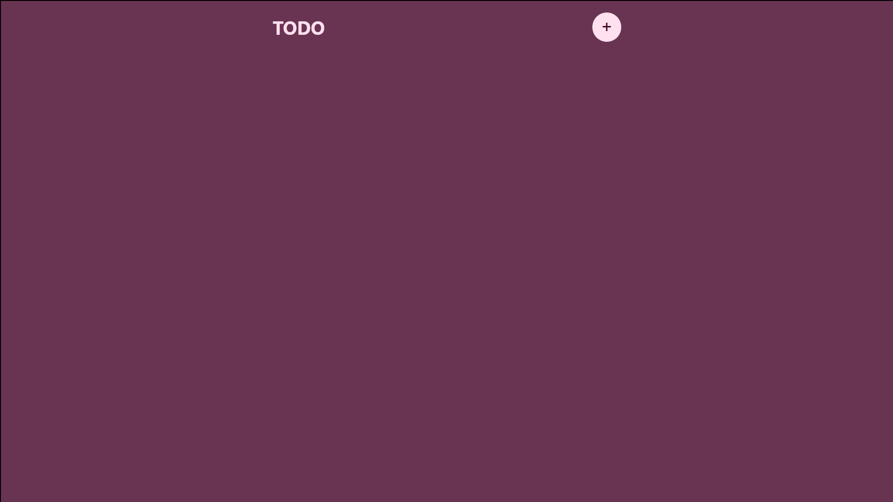

<h1 align="center">Todo List</h1>

Lista de Tarefas
 
<h3 align="center"><a href="" target="_blank"><strong>[ USE AGORA ]</strong></a></h3>

---

 

  

## 💻 Projeto

O todo list é uma lista de tarefas desenvolvida em React você pode criar tarefas, marca-las como feitas e deleta-las. As tarefas ficam salvas no seu armazenamento local.

## 🚀 Tecnologias

As seguintes ferramentas foram usadas na construção do projeto:

- [ReactJs]
- [Javascript]
- [HTML]
- [CSS]

Made with 💟 by Damien Costa ✌🏿

<a href="https://www.linkedin.com/in/damien-costa/" target="_blank">
